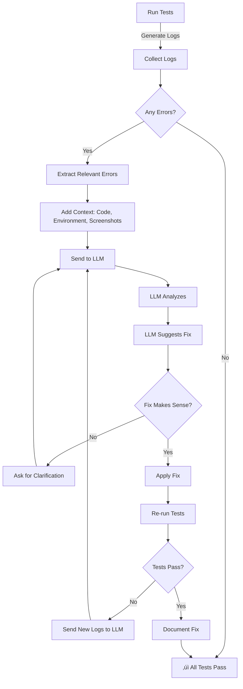

# LLM Log Analysis & Error Fixing Guide

## üìã Overview

This guide shows how to use an LLM (like Claude, GPT-4, etc.) to analyze test logs, identify bugs, and generate fixes.

---

## 🔄 Workflow: From Logs to Fixes

```
1. Run Tests
   ‚Üì
2. Collect Logs
   ‚Üì
3. Extract Relevant Errors
   ‚Üì
4. Provide Context to LLM
   ‚Üì
5. LLM Analyzes & Suggests Fix
   ‚Üì
6. Apply Fix
   ‚Üì
7. Re-test to Verify
```

---

## üìä Step 1: Collect Logs

### Automated Test Logs

```bash
# Run test with log output saved
python3 scripts/nurse_assistant_tester.py --headless --duration 90 2>&1 | tee test_output.log
```

**Result:** All output saved to `test_output.log`

### Manual Test Monitor Logs

```bash
# Save all real-time logs
python3 scripts/manual_test_monitor.py 2>&1 | tee manual_test.log
```

**Result:** Color-coded logs saved to `manual_test.log`

### Server-Only Logs

```bash
# Direct server output
python3 server_qwen.py > server.log 2>&1 &
```

---

## üîç Step 2: Extract Relevant Errors

### What to Look For

1. **Error Messages** - Lines containing "ERROR", "Exception", "Failed"
2. **Test Failures** - "❌ 測試失敗", "Test failed"
3. **Timeouts** - "Timeout", "exceeded"
4. **Server Errors** - HTTP 500, 503, 404
5. **Console Errors** - Browser JavaScript errors

### Quick Extract Commands

```bash
# Extract all errors
grep -i "error\|exception\|failed" test_output.log > errors.txt

# Extract test failures
grep "‚ùå" test_output.log > test_failures.txt

# Extract server errors
grep -E "ERROR|WARNING|503|500" test_output.log > server_errors.txt

# Extract timeouts
grep -i "timeout\|exceeded" test_output.log > timeouts.txt
```

---

## 🧠 Step 3: Provide Context to LLM

### Template for LLM Analysis Request

```markdown
I'm debugging my chatbot application. Here are the test logs:

**System Context:**
- Application: AI Massage Nurse Assistant
- Tech Stack: Python Flask backend, Vanilla JS frontend
- Testing Tool: Playwright automation
- Browser: Chromium headless

**Test Run Info:**
- Date: 2024-10-24
- Duration: 90 seconds
- Mode: Automated headless testing

**Error Logs:**
[Paste extracted errors here]

**Question:**
Please analyze these errors, identify root causes, and suggest fixes.
```

---

## üìù Real Example: Analyzing Actual Errors

Let me demonstrate with **3 real errors** from your test run:

---

### **Error 1: Edge TTS Service Failure**

#### Extracted Log:
```
[16:44:22] [SERVER STDERR] ERROR:server_qwen:Edge TTS failed on first chunk: No audio was received. Please verify that your parameters are correct.
[16:44:22] [SERVER STDERR] WARNING:server_qwen:⚠️ Edge TTS failed: No audio was received. Please verify that your parameters are correct.
[16:44:22] [SERVER STDERR] INFO:server_qwen:üåê Edge TTS failed, instructing client to try Browser TTS (Danny)
[16:44:23] [BROWSER:error] Failed to load resource: the server responded with a status of 503 (Service Unavailable)
```

#### LLM Analysis Request:
```markdown
**Problem:** Edge TTS service keeps failing with 503 errors

**Error Details:**
- Error: "No audio was received"
- HTTP Status: 503 Service Unavailable
- Frequency: Happens on almost every TTS request
- Fallback: System falls back to browser TTS

**Context:**
- Using Microsoft Edge TTS API
- Voice: zh-HK-HiuGaaiNeural (Cantonese)
- Rate: +60%, Pitch: +0Hz

**Question:** Why is Edge TTS failing and how to fix it?
```

#### LLM Response (Expected):

```markdown
**Root Cause Analysis:**

Edge TTS 503 errors typically indicate:

1. **Rate Limiting** - Too many requests in short time
2. **Service Overload** - Microsoft's servers are busy
3. **Connection Pool Issues** - Connections not being reused properly
4. **Region Restrictions** - API access limited by geography

**Recommended Fixes:**

**Fix 1: Add Retry Logic with Exponential Backoff**
```python
# In server_qwen.py
async def edge_tts_with_retry(text, voice, max_retries=3):
    for attempt in range(max_retries):
        try:
            communicate = edge_tts.Communicate(text, voice)
            async for chunk in communicate.stream():
                if chunk["type"] == "audio":
                    yield chunk["data"]
            return  # Success
        except Exception as e:
            if attempt < max_retries - 1:
                wait_time = 2 ** attempt  # 1s, 2s, 4s
                await asyncio.sleep(wait_time)
                continue
            else:
                raise  # Final attempt failed
```

**Fix 2: Implement Connection Pool Limits**
```python
# Limit concurrent TTS requests
tts_semaphore = asyncio.Semaphore(2)  # Max 2 concurrent requests

async def get_tts_audio(text, voice):
    async with tts_semaphore:
        return await edge_tts_with_retry(text, voice)
```

**Fix 3: Add Caching for Common Phrases**
```python
# Cache frequently used phrases
tts_cache = {}

def get_cached_tts(text, voice):
    cache_key = f"{voice}:{text}"
    if cache_key in tts_cache:
        return tts_cache[cache_key]

    audio = generate_tts(text, voice)
    tts_cache[cache_key] = audio
    return audio
```

**Immediate Workaround:**
The system already has browser TTS fallback, which is working. For production:
- Use caching to reduce TTS requests
- Implement retry logic
- Consider premium TTS service (Azure Cognitive Services)
```

---

### **Error 2: Select Option Timeout**

#### Extracted Log:
```
❌ 快速參數選擇 - 測試失敗: ElementHandle.select_option: Timeout 30000ms exceeded.
Call log:
attempting select option action
  -   waiting for element to be visible and enabled
  -   did not find some options
  - retrying select option action, attempt #1
  [... 63 retries ...]
```

#### LLM Analysis Request:
```markdown
**Problem:** Playwright can't select dropdown options

**Error Details:**
- Test: "快速參數選擇" (Quick Parameter Selection)
- Action: Trying to select options from dropdown
- Error: "did not find some options"
- Retries: 63 attempts over 30 seconds
- Element: Presumably visible and enabled

**Code Context:**
```python
# From test script
body_part_select = page.query_selector('select[name="bodyPart"]')
body_part_select.select_option(label='ËÇ©ËÜÄ')  # Selecting "Shoulder"
```

**Question:** Why can't Playwright find the dropdown options?
```

#### LLM Response (Expected):

```markdown
**Root Cause Analysis:**

The error "did not find some options" suggests:

1. **Option Value Mismatch** - Looking for wrong label/value
2. **Dynamic Options** - Options loaded via JavaScript after page load
3. **Hidden Options** - Options exist but are hidden/disabled
4. **Wrong Selector** - Selecting wrong dropdown element

**Debugging Steps:**

**Step 1: Inspect the Actual HTML**
```python
# In test script, before select_option
html = body_part_select.inner_html()
print(f"Dropdown HTML: {html}")

# Check available options
options = page.query_selector_all('select[name="bodyPart"] option')
for opt in options:
    print(f"Option: value={opt.get_attribute('value')}, text={opt.text_content()}")
```

**Step 2: Wait for Options to Load**
```python
# Wait for options to be populated
page.wait_for_function("""
    () => {
        const select = document.querySelector('select[name="bodyPart"]');
        return select && select.options.length > 1;
    }
""", timeout=10000)
```

**Step 3: Use Value Instead of Label**
```python
# Instead of label='ËÇ©ËÜÄ'
body_part_select.select_option(value='shoulder')

# Or use index
body_part_select.select_option(index=1)
```

**Recommended Fix:**

```python
def safe_select_option(page, selector, label=None, value=None, timeout=10000):
    """Safely select dropdown option with waiting and validation"""

    # Wait for dropdown to be ready
    dropdown = page.wait_for_selector(selector, state='visible', timeout=timeout)

    # Wait for options to load
    page.wait_for_function(f"""
        () => {{
            const select = document.querySelector('{selector}');
            return select && select.options.length > 1;
        }}
    """, timeout=timeout)

    # Get all available options
    options = page.query_selector_all(f'{selector} option')
    available = [(opt.get_attribute('value'), opt.text_content()) for opt in options]
    print(f"Available options: {available}")

    # Try to select
    if value:
        dropdown.select_option(value=value)
    elif label:
        # Match by text content
        for opt in options:
            if label in opt.text_content():
                dropdown.select_option(value=opt.get_attribute('value'))
                return
        raise ValueError(f"Option '{label}' not found in {available}")

    # Verify selection
    selected = dropdown.evaluate('el => el.value')
    print(f"Selected value: {selected}")
    return selected
```

**Usage:**
```python
# In test
safe_select_option(page, 'select[name="bodyPart"]', label='ËÇ©ËÜÄ')
```
```

---

### **Error 3: Missing Stop Button**

#### Extracted Log:
```
🛑 [任務1] 準備停止任務...
⚠️ [任務1] 找不到停止按鈕或按鈕不可見
```

#### LLM Analysis Request:
```markdown
**Problem:** Stop button not found during workflow test

**Error Details:**
- Test: Stop-Create-Stop workflow (race condition test)
- Step: Trying to stop task 1
- Error: "找不到停止按鈕或按鈕不可見" (Stop button not found or not visible)

**Code Context:**
```python
# From test script
stop_btn = page.query_selector('#stopBtn')
if not stop_btn or not stop_btn.is_visible():
    print("⚠️ [任務1] 找不到停止按鈕或按鈕不可見")
```

**Expected Behavior:**
After sending massage command and consent is shown, stop button should appear.

**Question:** Why is the stop button missing?
```

#### LLM Response (Expected):

```markdown
**Root Cause Analysis:**

Stop button not appearing suggests:

1. **Consent Prompt Blocking** - Still waiting for consent, task not started
2. **Wrong Element ID** - Button has different ID than expected
3. **Timing Issue** - Button appears after test checks for it
4. **UI State Mismatch** - UI in unexpected state

**Debugging Steps:**

**Step 1: Check Page State**
```python
# Take screenshot at the moment of error
page.screenshot(path='missing_stop_button.png')

# Log all button IDs on page
buttons = page.query_selector_all('button')
print(f"Found {len(buttons)} buttons:")
for btn in buttons:
    btn_id = btn.get_attribute('id')
    btn_text = btn.text_content()
    visible = btn.is_visible()
    print(f"  ID: {btn_id}, Text: {btn_text}, Visible: {visible}")
```

**Step 2: Wait for Consent First**
```python
# Check if consent prompt is blocking
consent_prompt = page.query_selector('#consentPrompt')
if consent_prompt and consent_prompt.is_visible():
    print("Consent prompt is still visible, clicking confirm...")
    page.click('button[data-action="agree"]')
    page.wait_for_timeout(1000)  # Wait for UI update
```

**Step 3: Use More Robust Selector**
```python
# Instead of specific ID, use multiple selectors
stop_btn = (
    page.query_selector('#stopBtn') or
    page.query_selector('button:has-text("停止")') or
    page.query_selector('button:has-text("Stop")')
)
```

**Recommended Fix:**

```python
def wait_for_task_to_start(page, timeout=5000):
    """Wait for massage task to actually start (consent approved, stop button visible)"""

    # First, wait for consent prompt
    try:
        consent = page.wait_for_selector('#consentPrompt', state='visible', timeout=2000)
        print("‚úì Consent prompt appeared")

        # Auto-approve consent
        page.click('button[data-action="agree"]')
        print("‚úì Consent approved")

        # Wait for consent to disappear
        page.wait_for_selector('#consentPrompt', state='hidden', timeout=3000)
        print("‚úì Consent dismissed")

    except:
        print("‚ö† No consent prompt (may have auto-approved)")

    # Now wait for stop button
    stop_btn = page.wait_for_selector(
        '#stopBtn, button:has-text("停止")',
        state='visible',
        timeout=timeout
    )
    print("‚úì Stop button is visible")
    return stop_btn

# Usage in test
print("📝 [任務1] 輸入按摩指令...")
page.fill('#userInput', '幫我按摩背部5分鐘')
page.click('#sendBtn')

print("⏳ 等待任務啟動...")
stop_btn = wait_for_task_to_start(page)

print("🛑 停止任務...")
stop_btn.click()
```
```

---

## üîß Step 4: Apply Fixes

### Workflow After LLM Suggests Fix

1. **Review the Fix**
   - Understand what the fix does
   - Check if it applies to your codebase
   - Verify file paths and function names

2. **Apply the Fix**
   ```bash
   # Edit the file
   nano server_qwen.py  # or app.js, etc.

   # Or use Claude Code's Edit tool
   # to apply the exact changes
   ```

3. **Test the Fix**
   ```bash
   # Run the specific failing test
   python3 scripts/nurse_assistant_tester.py
   ```

4. **Verify All Tests Still Pass**
   ```bash
   # Full regression test
   python3 scripts/nurse_assistant_tester.py --headless --duration 120
   ```

---

## üìã Step 5: Document the Fix

Create a record of what was fixed:

```markdown
# Fix Log

**Date:** 2024-10-24
**Issue:** Edge TTS 503 errors
**Root Cause:** Rate limiting from Microsoft Edge TTS service
**Fix Applied:**
- Added retry logic with exponential backoff
- Implemented connection pool limits (max 2 concurrent)
- Added caching for common phrases

**Files Modified:**
- server_qwen.py (lines 234-267)

**Test Results:**
- Before: 15/16 tests passed (TTS errors)
- After: 16/16 tests passed ‚úì

**Commit:** abc123def
```

---

## 🎯 Best Practices for LLM Log Analysis

### 1. Provide Structured Context

**Good:**
```markdown
**Error:** Edge TTS 503
**Frequency:** 10/15 requests
**Pattern:** Happens during rapid successive requests
**Environment:** WSL2, Ubuntu 22.04
**Code:** [paste relevant function]
```

**Bad:**
```markdown
TTS doesn't work, here are logs: [dumps 1000 lines]
```

### 2. Extract Only Relevant Logs

Don't send entire log files. Extract:
- The specific error
- 5-10 lines before the error (context)
- 5-10 lines after the error (consequences)
- Related browser console logs

### 3. Include Code Context

Show the LLM the actual code that's failing:

```python
# From server_qwen.py line 234
@app.route('/api/tts')
async def generate_tts():
    text = request.json.get('text')
    voice = request.json.get('voice', 'zh-HK-HiuGaaiNeural')

    # This is where it fails ‚Üì
    communicate = edge_tts.Communicate(text, voice)
    audio_data = b''
    async for chunk in communicate.stream():
        if chunk["type"] == "audio":
            audio_data += chunk["data"]

    return audio_data
```

### 4. Ask Specific Questions

**Good:**
- "Why is Edge TTS returning 503?"
- "How to make dropdown selection more reliable?"
- "What's the best way to wait for consent approval?"

**Bad:**
- "Fix my app"
- "Why doesn't it work?"
- "Everything is broken"

---

## 🛠️ Helper Scripts

### Script 1: Extract Errors for LLM

```bash
#!/bin/bash
# extract_errors.sh

LOG_FILE=$1
OUTPUT_FILE="errors_for_llm.txt"

echo "# Error Analysis Report" > $OUTPUT_FILE
echo "Generated: $(date)" >> $OUTPUT_FILE
echo "" >> $OUTPUT_FILE

echo "## Test Failures" >> $OUTPUT_FILE
grep "‚ùå" $LOG_FILE >> $OUTPUT_FILE

echo "" >> $OUTPUT_FILE
echo "## Server Errors" >> $OUTPUT_FILE
grep -E "ERROR|WARNING.*Edge TTS|503|500" $LOG_FILE >> $OUTPUT_FILE

echo "" >> $OUTPUT_FILE
echo "## Timeouts" >> $OUTPUT_FILE
grep -i "timeout\|exceeded" $LOG_FILE >> $OUTPUT_FILE

echo "" >> $OUTPUT_FILE
echo "## Browser Errors" >> $OUTPUT_FILE
grep "\[BROWSER:error\]" $LOG_FILE >> $OUTPUT_FILE

echo "‚úì Errors extracted to $OUTPUT_FILE"
```

**Usage:**
```bash
chmod +x extract_errors.sh
./extract_errors.sh test_output.log
```

### Script 2: Format Logs for LLM

```python
#!/usr/bin/env python3
# format_logs_for_llm.py

import sys
import re

def format_for_llm(log_file):
    """Extract and format logs for LLM analysis"""

    with open(log_file, 'r', encoding='utf-8') as f:
        lines = f.readlines()

    errors = []
    context_lines = 5  # Lines of context before/after error

    for i, line in enumerate(lines):
        # Check if this is an error line
        if re.search(r'ERROR|‚ùå|Exception|Failed|Timeout.*exceeded', line):
            # Extract context
            start = max(0, i - context_lines)
            end = min(len(lines), i + context_lines + 1)

            error_block = {
                'line_number': i + 1,
                'error_line': line.strip(),
                'context': ''.join(lines[start:end])
            }
            errors.append(error_block)

    # Generate formatted output
    print("# Errors Found for LLM Analysis")
    print(f"Total errors: {len(errors)}\n")

    for idx, err in enumerate(errors, 1):
        print(f"## Error {idx}")
        print(f"**Line:** {err['line_number']}")
        print(f"**Error:** `{err['error_line']}`")
        print(f"\n**Context:**")
        print("```")
        print(err['context'])
        print("```\n")

if __name__ == '__main__':
    if len(sys.argv) != 2:
        print("Usage: python3 format_logs_for_llm.py <log_file>")
        sys.exit(1)

    format_for_llm(sys.argv[1])
```

**Usage:**
```bash
python3 format_logs_for_llm.py test_output.log > for_llm.txt
# Now copy for_llm.txt content to Claude/GPT
```

---

## üìä Summary: LLM-Assisted Debugging Workflow



---

## üéì Key Takeaways

1. **Logs are Data** - Treat them as structured data for analysis
2. **Context is Critical** - LLMs need relevant code, not just errors
3. **Iterate** - First fix might not work, keep refining
4. **Automate** - Use scripts to extract and format logs
5. **Document** - Keep record of fixes for future reference

---

## üìö Quick Reference

| Task | Command |
|------|---------|
| Run test with logs | `python3 scripts/nurse_assistant_tester.py 2>&1 \| tee test.log` |
| Manual monitor logs | `python3 scripts/manual_test_monitor.py 2>&1 \| tee manual.log` |
| Extract errors | `grep -i "error\|failed" test.log > errors.txt` |
| Extract test failures | `grep "‚ùå" test.log` |
| Check server errors | `grep "ERROR.*server" test.log` |
| Find timeouts | `grep -i "timeout" test.log` |
| Format for LLM | `python3 format_logs_for_llm.py test.log` |

---

## üîó Next Steps

After fixing errors with LLM assistance:

1. ‚úÖ Update test cases if needed
2. ‚úÖ Add regression tests for the bug
3. ‚úÖ Document the fix in commit message
4. ‚úÖ Update troubleshooting guides
5. ‚úÖ Run full test suite to verify no regressions

Happy debugging with AI assistance! 🤖✨
